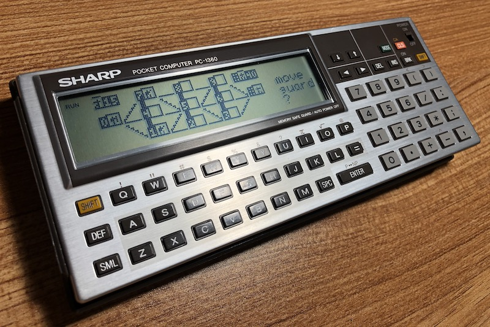

# Alcatraz!

A self-learning strategy game with AI for SHARP pocket computers.

The pocket computer AI is your opponent, playing the role of a Prisoner who
tries to escape from Alcatraz.  Your task is to catch the prisoner.  You have
three Guards at your disposal, so that makes it easy! Right?

Every time a Prisoner is caught, the Prisoner learns from his mistakes and
will not make the same mistake again!  The Prisoner gets smarter and smarter,
just as you learn to find new ways to catch the Prisoner.

The goal is to catch the prisoner as many times as possible.  There are at
least fourty different ways to catch the Prisoner.  Can you get to fourty or
more captures?

The game board has 11 positions called Rooms, numbered `0` to `9` and a Prison
Cell `:`.  Room `0` is the Prison Gate from which the Prisoner can escape.

    Prison      _7___8___9_
               / | \ | / | \
        Gate 0/__4__\5/__6__\: Cell
              \  | / | \ |  /
               \_1/__2__\3_/

Rooms are connected by elevators (up/down moves), stairs (diagonal moves), and
floors (horizontal moves).

Your three Guards begin at the left of the board in rooms `0`, `1` and `7`.  To
move a guard from one Room to the next, type in the number `0` to `9` or `:`
(or any other key for `:`) for the Room to move from, then the Room to move to.

A Prisoner begins in his Prison Cell at position `:`.

## The rules:

1. The two players (you versus the computer) take turns and have to move to a
   connecting Room.

2. Either the Prisoner starts the first move or you start, which is random. If
   the Prisoner starts the first move, then he will move out of his Cell to
   one of the connecting Rooms.

3. The Prisoner and Guards can only move to an empty connecting Room.

4. If the Prisoner cannot move because all connecting Rooms are occupied, then
   he is caught and your winning score is increased.

5. If the Prisoner can reach the Gate (Room `0`) then he wins by escaping.

6. Guards cannot move backward, to the left, except from the Cell (Room `:`)
   where a Guard can freely move back to a connecting Room.

7. If after 30 moves the Prisoner is still not caught, then he will escape
   regardless.

Enjoy!

## How to load

Use the excellent [PocketTools](https://www.peil-partner.de/ifhe.de/sharp/)
to convert BASIC source code to wav files:

    bas2img --pc=1350 --level=8 alcatraz.bas
    bin2wav --pc=1350 alcatraz.img

Then `CLOAD` on your pocket computer.

Author: Dr. Robert A. van Engelen
